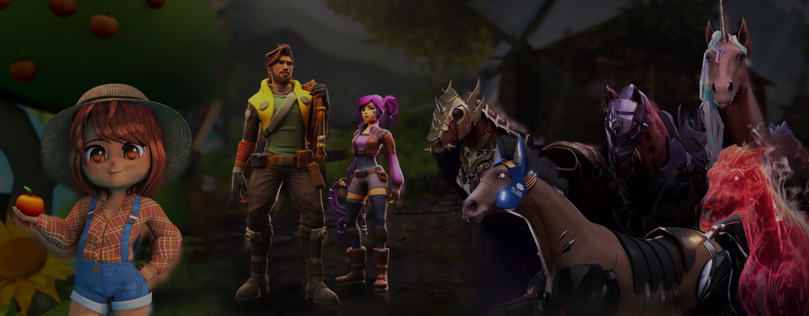
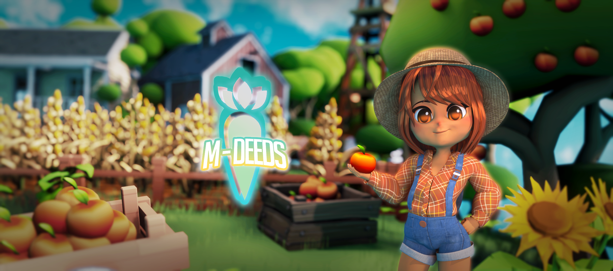

# About

We believe in future where learning and play are united.

We want to provide players financial opportunities to mitigate unforeseen problems such as poverty and inequality. And above all, imagine a future where gaming can change the world.

Our project's mission is to create a playful and user-friendly way for the general public to understand and adopt block-chain technology. 
Our project uses NFT racehorses as a tool to entertain and learn for the future of gaming and virtual reality.

# Legendary Marketplace

### Trade Legendary items for cryptocurrency on the in-game and web Marketplace.

Join the community and dive into a world of endless possibilities.

# Getting Started
- OS: 
  Mac, Linux, Windows 
    \*This project works best on macOS. If you encounter any problems while using other operating systems, please contact the administrator.
- Prerequirements: 
  Node v20.x.x, Google Chrome
- Installing Dependecies: 
  npm install 
-  Running project: 
  npm start
